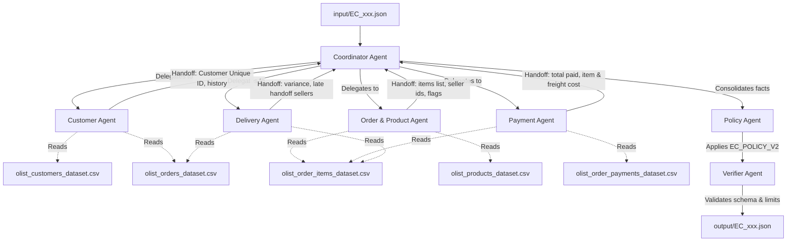

# Hệ thống Multi-Agent Giải quyết Khiếu nại Thương mại Điện tử Olist

Tài liệu này mô tả kiến trúc multi-agent, vai trò cụ thể của từng agent, quyền truy cập dữ liệu và luồng handoff thông tin trong hệ thống giải quyết tranh chấp đơn hàng của Olist.

## 1. Sơ đồ Kiến trúc và Luồng trao đổi thông tin (Handoff)

---

## 2. Chi tiết vai trò và quyền truy cập dữ liệu của từng Agent

### 2.1. Coordinator Agent
* **Vai trò**: Điểm tiếp nhận trung tâm của mỗi case khiếu nại. Có nhiệm vụ điều phối và kích hoạt các Agent phân tích dữ liệu chuyên biệt, thu thập kết quả trung gian, chuyển giao toàn bộ thông tin cho `Policy Agent`, và cuối cùng chuyển kết quả cho `Verifier Agent` trước khi xuất file.
* **Handoff**: Chuyển giao `claimed_order_id` cho 4 agent phân tích; chuyển toàn bộ kết quả phân tích cho `Policy Agent`.

### 2.2. Customer Agent
* **Vai trò**: Xác minh thông tin danh tính của khách hàng từ `claimed_order_id`. Xác định lịch sử mua sắm của khách hàng để tìm các cờ `repeat_customer` và cung cấp danh sách `related_order_ids` (nếu có).
* **Dữ liệu truy cập**: `olist_customers_dataset.csv`, `olist_orders_dataset.csv`.
* **Handoff**: Trả về `customer_unique_id`, `related_order_ids`, `repeat_customer` và tóm tắt lịch sử mua hàng.

### 2.3. Order & Product Agent
* **Vai trò**: Truy xuất toàn bộ thông tin chi tiết về các sản phẩm có trong đơn hàng khiếu nại. Xác định xem đơn hàng có nhiều mặt hàng (`multi_item_order`), nhiều nhà bán hàng (`multi_seller_order`) hoặc nhiều danh mục sản phẩm khác nhau (`multiple_categories`) hay không.
* **Dữ liệu truy cập**: `olist_order_items_dataset.csv`, `olist_products_dataset.csv`.
* **Handoff**: Trả về danh sách `product_ids`, `category_names`, `seller_ids` và các cờ phân loại sản phẩm.

### 2.4. Payment Agent
* **Vai trò**: Đối soát các dòng thanh toán thực tế của khách hàng so với tổng tiền hàng và tiền ship dự kiến của đơn hàng.
* **Dữ liệu truy cập**: `olist_order_payments_dataset.csv`, `olist_order_items_dataset.csv`.
* **Handoff**: Trả về `payment_ids`, tổng tiền hàng, tổng tiền ship, tổng tiền thanh toán thực tế, độ chênh lệch (`difference_brl`), trạng thái đối soát khớp (`reconciled`) và cờ `split_payment` (nếu thanh toán nhiều đợt).

### 2.5. Delivery Agent
* **Vai trò**: Tính toán chi tiết các khoảng thời gian vận chuyển. Xác định chênh lệch giờ giữa ngày giao thực tế và ngày dự kiến (`delivery_variance_hours`). Đồng thời đối soát ngày bàn giao cho vận chuyển của từng nhà bán hàng để phát hiện các seller bàn giao muộn (`late_handoff_seller_ids`).
* **Dữ liệu truy cập**: `olist_orders_dataset.csv`, `olist_order_items_dataset.csv`.
* **Handoff**: Trả về `delivered_at`, `estimated_delivery_at`, `carrier_handoff_at`, `delivery_variance_hours` và chi tiết các nhà bán hàng bàn giao muộn.

### 2.6. Policy Agent
* **Vai trò**: Bộ não ra quyết định nghiệp vụ của hệ thống. Agent này nhận thông tin phân tích từ tất cả các agent chuyên biệt, đối chiếu với bộ quy tắc `EC_POLICY_V2` để kết luận Vấn đề chính (`primary_issue`), Vấn đề phụ (`secondary_issues`), phân định trách nhiệm (`responsible_parties`), tính toán tiền hoàn đề xuất (`recommended_refund_brl`), và xây dựng chuỗi hành động giải quyết (`resolution_actions`) cùng danh sách ID bằng chứng (`evidence_ids`).
* **Handoff**: Trả về cấu trúc giải quyết khiếu nại sơ bộ cho `Verifier Agent`.

### 2.7. Verifier Agent
* **Vai trò**: Agent kiểm duyệt chất lượng. Có nhiệm vụ rà soát cấu trúc schema JSON kết quả, áp dụng các giới hạn cứng của bài toán (ví dụ: tối đa 20 evidence, 5 actions, 3 sellers, v.v.), làm tròn độ tin cậy (`confidence` về khoảng 0.0 - 1.0) và sửa các định dạng sai sót để đảm bảo output hoàn hảo 100%.

---

## 3. Cơ chế Kiểm soát Tính đúng đắn của Dữ liệu

Để giải quyết vấn đề LLM thường tính toán số học và thời gian sai lệch, hệ thống kết hợp sức mạnh của **Python logic cứng** để tính toán chính xác các con số và ngày tháng, sau đó nhúng trực tiếp thông tin chính xác này vào prompt để LLM Agent đưa ra các lập luận phân tích ngữ cảnh, tính điểm tự tin và phân loại vấn đề. Cơ chế này giúp triệt tiêu hoàn toàn lỗi ảo giác (hallucination) toán học của mô hình.
