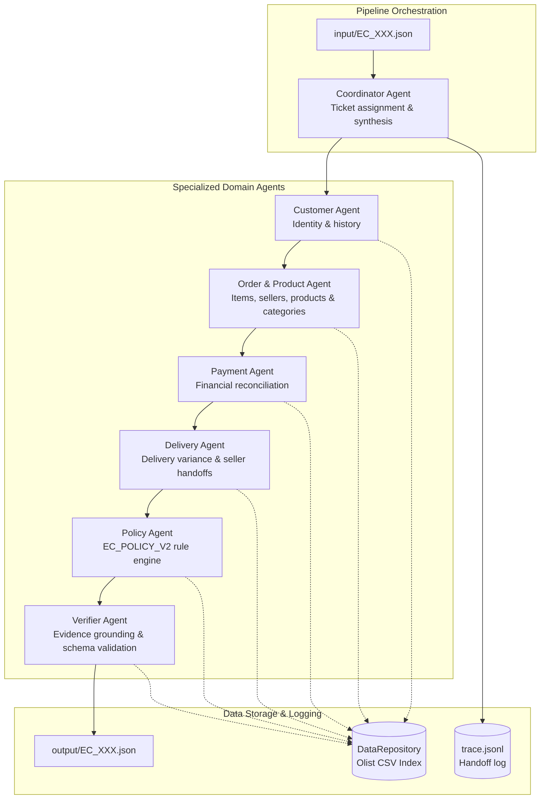

# Architecture Documentation - Multi-Agent E-commerce Dispute Resolution

## 1. Overview

System architecture for K4 Day 9 Multi-Agent Dispute Resolution on Olist Brazilian E-Commerce dataset.
The system implements a 7-agent cooperative workflow using Groq Cloud API with `llama-3.1-8b-instant`.
Data retrieval, calculations, and rule evaluation are performed deterministically in Python.
The LLM layer handles narrative synthesis, handoff context transfer, and quality validation.



## 2. Agent Roles & Data Access

| Agent Name | Scope & Data Access | Key Responsibilities | Evidence Produced |
|------------|---------------------|----------------------|-------------------|
| **Coordinator Agent** | Case input JSON | Receives case ticket, dispatches workflow across domain agents, and aggregates results. | - |
| **Customer Agent** | `olist_orders_dataset.csv`, `olist_customers_dataset.csv` | Resolves customer unique ID and identifies related historical orders. | - |
| **Order & Product Agent** | `olist_order_items_dataset.csv`, `olist_products_dataset.csv`, `olist_sellers_dataset.csv`, `product_category_name_translation.csv` | Analyzes item count, sellers, products, translated categories, and item/freight totals. | `item:*`, `seller:*` |
| **Payment Agent** | `olist_order_payments_dataset.csv` | Reconciles total payment rows against expected total from Order agent. | `payment:*` |
| **Delivery Agent** | `olist_orders_dataset.csv`, `olist_order_items_dataset.csv` | Computes delivery variance hours and per-seller handoff variance hours. | `order:*` |
| **Policy Agent** | `EC_POLICY_V2` business rules | Evaluates primary/secondary issues, root cause code, responsible parties, refund amount, and actions in strict priority order. | `policy:*` |
| **Verifier Agent** | All 9 Olist CSV datasets | Verifies evidence ID grounding against source data, array limits, numeric precision, and schema compliance. | - |

## 3. Handoff Protocol

Each inter-agent handoff message follows a structured contract:

```json
{
  "ticket_id": "EC_001",
  "sender": "OrderProductAgent",
  "recipient": "PaymentAgent",
  "question": "Analyze payment reconciliation with expected total.",
  "facts_found": [
    {
      "description": "Order items and product context analyzed",
      "source_ids": ["item:9b75cdaf2d85857ef023980e15d01546:1"],
      "value": {
        "expected_total_brl": 237.34
      }
    }
  ],
  "facts_missing": [],
  "next_suggestion": "Order composition analyzed."
}
```

## 4. Policy Execution Flow (EC_POLICY_V2)

Primary issues are evaluated in strict priority order:
1. `canceled_order_paid`: Order status is `canceled` and total payment > 0.
2. `unavailable_order_paid`: Order status is `unavailable` and total payment > 0.
3. `late_delivery_seller`: Delivered after estimated date AND at least one seller handoff exceeded limit date.
4. `late_delivery_logistics`: Delivered after estimated date AND no seller handoff was late.
5. `valid_split_payment`: 2 or more payment rows AND payment total matches expected total within 0.10 BRL.
6. `unsupported_late_claim`: Delivered within estimate AND payment reconciled.

Secondary issues are appended in fixed order:
1. `multi_item_order`
2. `multi_seller_order`
3. `split_payment`
4. `repeat_customer`
5. `multiple_categories`

## 5. Verification & Grounding Guarantee

The Verifier Agent inspects every evidence ID before final output generation.
Evidence IDs must exist in source CSV files:
- `order:<order_id>` -> verified in orders CSV.
- `item:<order_id>:<item_id>` -> verified in order_items CSV.
- `payment:<order_id>:<seq>` -> verified in order_payments CSV.
- `seller:<seller_id>` -> verified in sellers CSV.
- `policy:<root_cause_code>` -> verified against valid policy codes list.
